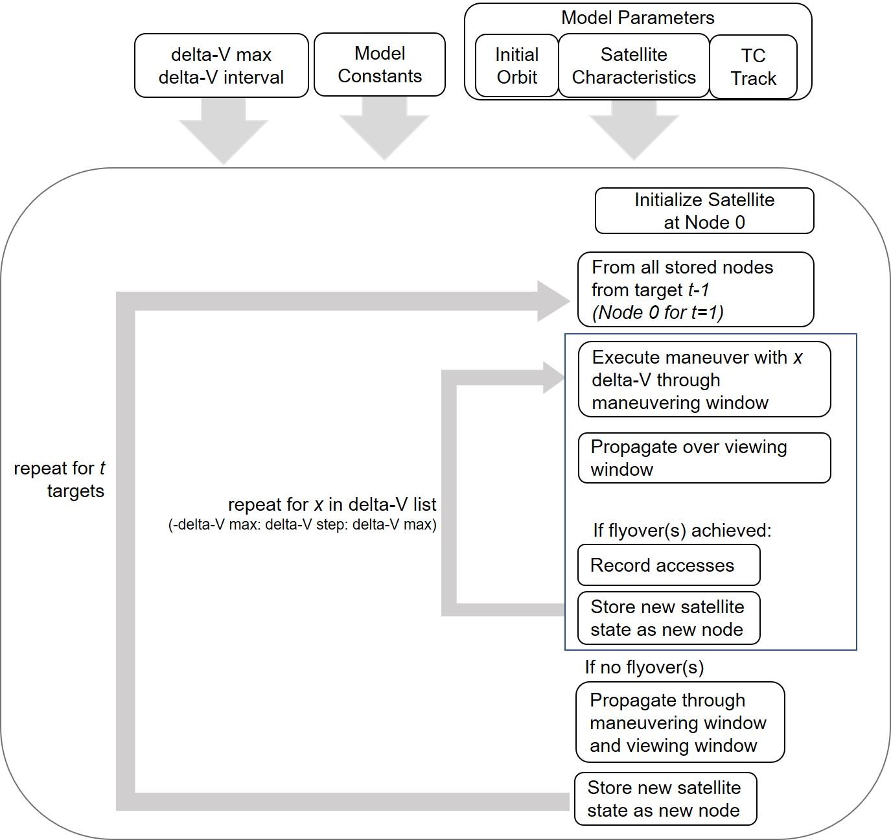

# Mobile-Target-Tracking

## Motivation
This code (primarily in Python) can be used to plan sequential low thrust maneuvers for satellites tracking a mobile target- particularly, this has been used for tracking hurricanes as in [[1]](#1) and [[2]](#2).
This code compilaiton is a result of my Master's thesis here: [[3]](#3). Several case studies are shown there with a more in-depth discussion of this procedure of adaptable maneuver planning. 

## Contents of the GitHub
Several methods for maneuver planning are included in this Github. Each of these show possible sequential maneuver solutions to achieve accesses of the mobile target at defined target locations with associated target times.
* __Graph theory approach__ - (Python) this is similar to the approach used by McGrath et al. [[1]](#1). Possible maneuvers are displayed in a tree of sequential solutions

* __Optimization (GA) approach__ - (Python) this approach utilizes continous 

* __GUI__ - (Matlab and Python) this interface allows a user to define external inputs, which will display the output of the optimization approach

### Inputs

### Methods
#### Graph Theory Approach 

##### Output

#### Genetic Algorithm Use

##### Output

#### GUI

##### Output

## Sources:
Raising and lowering equations sourced from: DOI: https://doi.org/10.5281/zenodo.4452978
These are from the paper: https://doi.org/10.2514/1.G003739 

<a id="1">[1]</a> 
McGrath, Ciara N., Ruaridh A. Clark, Astrid Werkmeister, and Malcolm Macdonald. “Small Satellite Operations Planning for Agile Disaster Response Using Graph Theoretical Techniques.” Washington, D.C., 2019. https://www.iac2019.org.

<a id="2">[2]</a> 
Morgan, Sarah J., Ciara McGrath, and Olivier L. De Weck. “Mobile Target Tracking Using a Reconfigurable Low Earth Orbit Constellation.” In ASCEND 2020. Virtual Event: American Institute of Aeronautics and Astronautics, 2020. https://doi.org/10.2514/6.2020-4247.

<a id="3">[3]</a> 
Thesis will be posted in MIT DSpace: https://dspace.mit.edu/ 
It is not yet posted (5/24/2021) but once it is posted, it can be found under the title: "Reconfigurable Satellite Constellations for Mobile Target Tracking" by Sarah J. Morgan

<a id="4">[4]</a> 
Mcgrath, Ciara, and Malcolm Macdonald. “General Perturbation Method for Satellite Constellation Reconfiguration Using Low-Thrust Maneuvers.” Journal of Guidance, Control, and Dynamics 42 (July 2019): 1–17. https://doi.org/10.2514/1.G003739.
