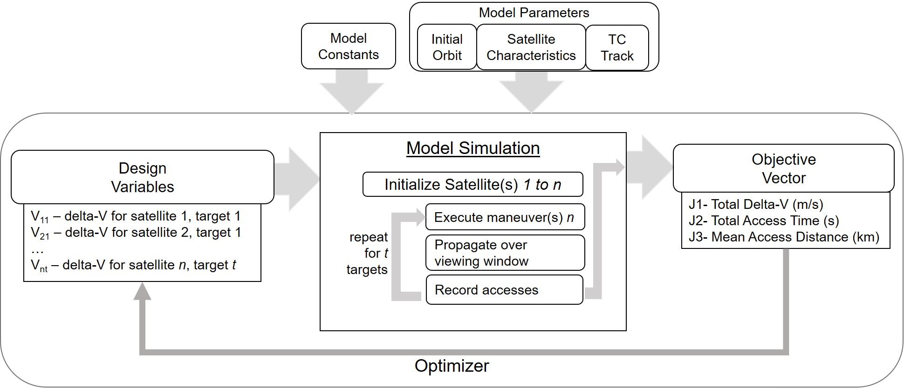
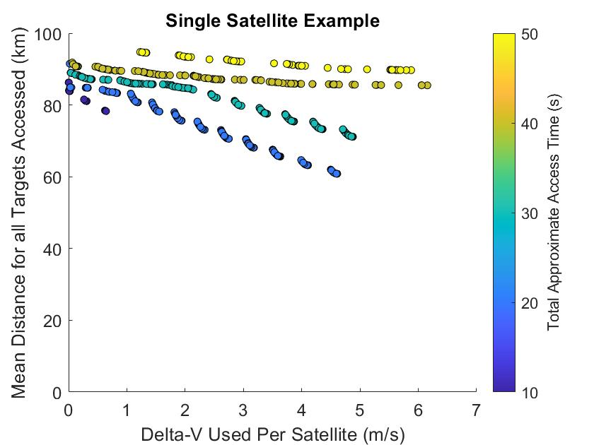
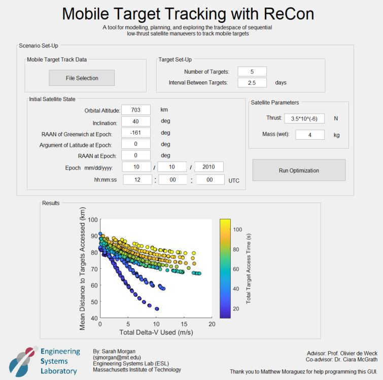
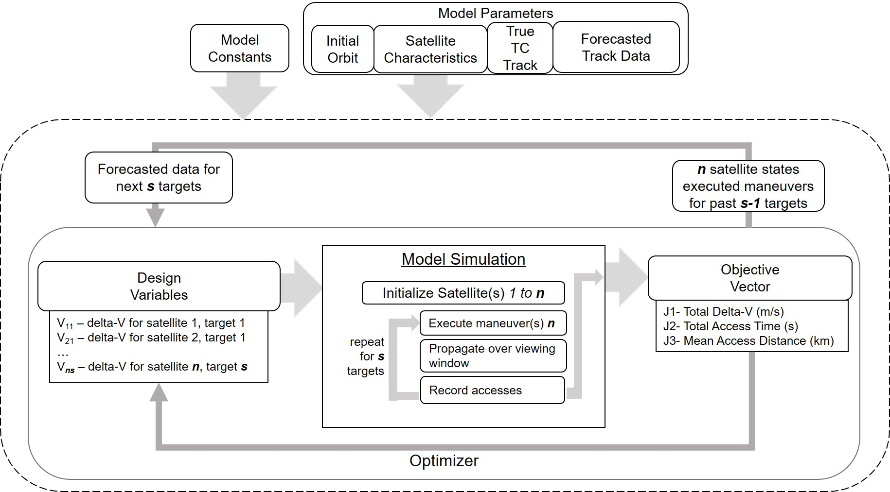

# Mobile Target Tracking
This code compilation is a result of my (Sarah Morgan's) SM thesis here: [[3]](#3). Several case studies are shown there with a more in-depth discussion of this procedure of adaptable maneuver planning. 
© Massachusetts Institute of Technology 2021.

## Motivation
This code (primarily in Python) can be used to plan sequential low thrust maneuvers for satellites tracking a mobile target- particularly, this has been used for tracking hurricanes as in [[1]](#1), [[2]](#2), and [[3]](#3).  This is enabled by an analytical solution for low-thrust three-phase maneuvers (either raising or lowering orbit altitude for a drift period before returning to the original altitude to shift satellite right ascension of ascending node and argument of latitude [[4]](#4).  

## Summary of Approaches
Several methods for maneuver planning are included in this repository. Each of these show possible sequential maneuver solutions to achieve accesses of the mobile target at defined target locations with associated target times. Each essentially follow the following process:
* targets are defined along the hurricane track, each with some _viewing window_ (i.e. the satellite should view the storm at 10/10/2010 12:00 UTC +/- 20 hours)
    * the hurricane track will be interpolated between available points to approximate its location at each point in time in the model
* satellite(s) initialized at epoch with given initial conditions
* the satellite maneuvers with some delta-V (according to the approach used) over a fixed maneuver duration
* the satellite is then propagated (no delta-V applied) over the fixed _viewing window_
* storm accesses are recorded
* several delta-V options are attempted, according to the approach used
    * if there are no accesses recorded for a given target, the satellite will propagate through this maneuver duration (no delta-V applied)

All of the resulting delta-V solutions and associated storm accesses are recorded and presented according to the methods described below (i.e. displayed in a tree as the output of the graph theory approach or shown as a non-dominated set as the output from optimization). 

### Inputs
Each of these methods require the following inputs:
* initial satellite(s) state (can include multiple satellites)
    * orbit altitude
    * orbit inclination
    * initial right ascension of ascending node (_RAAN_)
    * initial argument of latitude (_u_ - some places this may be _AOL_)
    * epoch date/time
    * right ascension of Greenwich at epoch
* satellite mass
* satellite maximum thrust capability
* target track to be used (and desired spacing of target points along the track)

The following assumptions are made:
* J2 effects only are included
* only circular orbits are used
* the general perturbation analytical solution is used for both propagation and raising/lowering maneuvers (an approximation as opposed to something like a numerical solution)
* initial and ending altitude of the three-phase maneuvers are the same
* model parameters:
   * mean Earth radius: 6371000 m
   * Earth flattening parameter: 0.00335281
   * angular velocity of the Earth: 7.29212*10^(-5) rad/s
   * standard gravitational parameter: 3.98600*10^(14) m^3/s^2
   * coefficient of the Earth's gravitational zonal harmonic of the 2nd degree (J2): 1082.7*10^(-6)

## __Graph theory approach__:
### Description:
(Python) this is similar to the approach used by McGrath et al. [[1]](#1). Possible maneuvers are displayed in a tree- this involves discretizing the maneuver space. For example, the satellite will maneuver from epoch with some delta-V (i.e. 0.5m/s, 1 m/s, 1.5 m/s). This delta-V step size can be adjusted. In this graph theory approach, each satellite state is a node, maneuvered to the next state by an edge of some delta-V. So, for example, a satellite will begin at node 0, maneuver with 0.5m/s, 1m/s and 1.5m/s, attempting to view Target 1. Each of these maneuver options are shown as edges branching from node 0, creating nodes 1, 2, and 3. Then, the satellite will maneuver from each of these states attempting to view Target 2, and so on. This will create a graph of possible maneuvers, with each branch representing a possible set of sequential maneuvers.  In this particular code, the NetworkX package [[5]](#5) was used to create the graph. 

There are a number of ways to analyze the resulting graph. Currently, the shortest path (lowest delta-V) is recorded, found through Dijkstra’s method as in <a id="1">[1]</a>. 

### Process:
The process as described above is shown in the flowchart below. 
Note in the code a negative delta-V corresponds to a lowering maneuver (delta-V applied opposite the satellite velocity vector) and a positive delta-V (delta-V applied in the direction of the satellite velocity vector) corresponds to a raising maneuver. 

### Output
The result of this is a graph of possible maneuver options with the lowest delta-V solution (the graph as generated by NetworkX and the satellite states at each node). This is stored in networkx graph object G and in a csv of all nodes. An image of the graph can be generated as well with the lowest delta-V solution highlighted. 

#### Example (using Typhoon Megi case study)
For a 3-target optimization with delta-V options of (-5:0.5:5 m/s) per maneuver, this approach takes around 20 seconds to produce results on a PC with 16 GB RAM (CPU: Intel Core i7 @ 1.9GHz). Note this will take an exponentially greater amount of time with more targets (increasing tree depth). 

A resulting example graph plot is below:

While not visible at this scale, each edge is labeled with the delta-V required, and each node is numbered. 

The nodes are stored here [./output/graph_theory_nodes_example.csv](./output/graph_theory_nodes_example.csv). 

## __Optimization (GA) approach__
### Description:
(Python) this approach utilizes continuous exploration of possible delta-V space. Rather than plan discretized possible maneuvers with a graph approach, a genetic algorithm searches the space of possible delta-V options continuously. In this particular case, pymoo [[6]](#6) was used to enable multiple objective optimization, specifically a BRKGA was used. The objectives used are currently (minimizing) mean distance to targets accessed, (maximizing) target access time, and (minimizing) delta-V used. 

### Process:
The process as described above is shown in the flowchart below. 
Note in the code a negative delta-V corresponds to a lowering maneuver (delta-V applied opposite the satellite velocity vector) and a positive delta-V (delta-V applied in the direction of the satellite velocity vector) corresponds to a raising maneuver. 

### Output
From the genetic algorithm (running [optimization_GA.py](optimization_GA.py)), the nondominated set is output. Currently this is in two csv files, one containing the design variables (the delta-Vs used) and one containing the objectives. 

#### Example (using Typhoon Megi case study)
For a 3-target optimization with delta-V options of at most 5 m/s per maneuver, this approach takes around 35 minutes to produce results on a PC with 16 GB RAM (CPU: Intel Core i7 @ 1.9GHz). 
- [./output/output_ga_example_designvar.csv](output_ga_example_designvar.csv)
- [./output/output_ga_example_objectives.csv](output_ga_example_objectives.csv)

These can be plotted:

## __GUI Framework__
(MATLAB and Python) this interface would allow a user to define external inputs, which will display the output of the optimization approach. This code is not yet complete (integration of python files with MATLAB interface required). The mock-up below is generated by the file 'mobile_target_gui.m' - this file can be adjusted to generate results from the inputs given. 

## __Future Work__
An approach that is discussed in [[3]](#3) includes utilizing forecasted track data. This can be created by simply adjusting the inputs for the 'series_of_maneuvers.py' file and loading different target data for each updated forecast. 

Additionally, a worthwhile addition to be explored includes using alternative objectives.

## How to Use
- Download all code in this repository. 
- Contents include:
    - (Folder) output
        - this include example outputs
    - (Folder) target_tracks
        - megi_data.xlsx : _This is a set of Typhoon Megi data, sourced from: [[7]](#7)_
    
    - graph_theory.py (\*): _this script takes in a maximum delta-V, and given initial conditions and a mobile target track (defined within the script) will output the resulting graph as described above (G) and satellite states in a .csv, along with the shortest path description from G. The resulting graph is also shown in a generated image._
        - Dependent files:
        - distance_SSP_to_target.py : _this script takes in latitude/longitude of two different points and outputs the distance between them on the Earth in meters_
        - load_hurricane_data.py : _given a track file, this outputs targets along the track, timed from scenario epoch_
        - lowering_maneuver.py : _this utilizes RAAN_AOL_equations_python.py to conduct a lowering three-phase low-thrust maneuver_
        - propagate.py : _this utilizes RAAN_AOL_equations_python.py to propagate the satellite_
        - RAAN_AOL_equations_python.py : _sourced from: DOI: https://doi.org/10.5281/zenodo.4452978 These are from the paper: https://doi.org/10.2514/1.G003739_
        - raising_manevuer.py : _this utilizes RAAN_AOL_equations_python.py to conduct a raising three-phase low-thrust maneuver_
    - graphing_individual.m (\*): _this is just a simple MATLAB script to plot the nondominated set of the optimization approach output_
    - mobile_target_gui.m (\*): _framework for GUI utilizing optimization approach _
    - optimization_GA.py (\*): _this script runs a GA with series_of_maneuvers as the base function_
        - Dependent files:
        - distance_SSP_to_target.py : _this script takes in latitude/longitude of two different points and outputs the distance between them on the Earth in meters_
        - load_hurricane_data.py : _given a track file, this outputs targets along the track, timed from scenario epoch_
        - lowering_maneuver.py : _this utilizes RAAN_AOL_equations_python.py to conduct a lowering three-phase low-thrust maneuver_
        - propagate.py : _this utilizes RAAN_AOL_equations_python.py to propagate the satellite_
        - RAAN_AOL_equations_python.py : _sourced from: DOI: https://doi.org/10.5281/zenodo.4452978 These are from the paper: https://doi.org/10.2514/1.G003739_
        - raising_manevuer.py : _this utilizes RAAN_AOL_equations_python.py to conduct a raising three-phase low-thrust maneuver_
        - series_of_manevuers.py (\*): _this outputs characteristics of flyovers for a given maneuver pattern (list of delta-Vs) given initial conditions and a mobile target track (defined within the script)_ 

- The following packages are needed in addition to the defaults included with Anaconda installation. (with Python version 3.7.10)
    - matplotlib (version 3.4.2 used)
        - (!) Note: there appears to be an incompatibility between older versions of networkx and matplotlib- if you get a matplotlib error, check your versions
    - networkx (version 2.4 used)
    - numpy (version 1.20.0)
    - openpyxl (version 3.0.7 used)
    - pygraphvix or pydot (version 1.7 used)
    - pymoo (version 0.4.2.2)

- Change any inputs for your mission scenario or particular application. These changes should be made to the files marked with an (\*) in the contents list above    
    - Inputs (i.e. mission scenario variables like ground tracks to be used, satellite initial states, etc.) to be changed for each approach are in [graph_theory.py](graph_theory.py) and [series_of_maneuvers.py](series_of_maneuvers.py) respectively. 
        - Any changes to the optimizer should be made in [optimization_GA.py](optimization_GA.py).  
        - More satellites can be added by adding to the initial satellite list, and defining additional dVs as needed
            - For example- for GA approach, in [series_of_maneuvers.py](series_of_maneuvers.py):
                - Make input (dV11, dV12, dV13, dV21, dV22, dV23, disp_flag), 
                - Increase num_sats=2
                - dV_list = [[dV11, dV12, dV13],[dV21, dV22, dV23]] 
            - This will make two satellites with three maneuvers (three targets). n_var, xl, xu, and the inputs for series_of_maneuvers in [optimization_GA.py](optimization_GA.py) would also have to be changed
        - Alternate objectives can be used/changed as well in [series_of_maneuvers.py](series_of_maneuvers.py)

- The graph theory and genetic algorithm approaches can be run by files [graph_theory.py](graph_theory.py) and [optimization_GA.py](optimization_GA.py) respectively.

- If you maintain the same file structure and defaults, outputs will be saved in the 'output' folder
 

Some notes that may be helpful for beginner coders (like myself, at the start of this project!):
- I recommend using Anaconda for easier package management (https://docs.anaconda.com/anaconda/) and convenient IDE Spyder! I used Python version 3.7, and set up a virtual environment for this. 
     - virtual environments help ensure there are no conflicts in the versions of packages installed, and help keep things separate from other projects  
- Adjust file paths as needed (this was done on a Windows machine, filepath may be needed to change on other OS).

## Sources:
Raising and lowering maneuver equations (RAAN_AOL_equations_python.py) sourced from: DOI: https://doi.org/10.5281/zenodo.4452978
These are from the paper: https://doi.org/10.2514/1.G003739 

<a id="1">[1]</a> 
McGrath, Ciara N., Ruaridh A. Clark, Astrid Werkmeister, and Malcolm Macdonald. “Small Satellite Operations Planning for Agile Disaster Response Using Graph Theoretical Techniques.” Washington, D.C., 2019. https://www.iac2019.org.

<a id="2">[2]</a> 
Morgan, Sarah J., Ciara McGrath, and Olivier L. De Weck. “Mobile Target Tracking Using a Reconfigurable Low Earth Orbit Constellation.” In ASCEND 2020. Virtual Event: American Institute of Aeronautics and Astronautics, 2020. https://doi.org/10.2514/6.2020-4247.

<a id="3">[3]</a> 
Thesis will be posted in MIT DSpace: https://dspace.mit.edu/ 
It is not yet posted (5/24/2021) but once it is posted, it can be found under the title: "Reconfigurable Satellite Constellations for Mobile Target Tracking" by Sarah J. Morgan

<a id="4">[4]</a> 
Mcgrath, Ciara, and Malcolm Macdonald. “General Perturbation Method for Satellite Constellation Reconfiguration Using Low-Thrust Maneuvers.” Journal of Guidance, Control, and Dynamics 42 (July 2019): 1–17. https://doi.org/10.2514/1.G003739.

<a id="5">[5]</a>  Hagberg, Aric, Dan Schult, and Pieter Swart. “NetworkX — NetworkX Documentation.” NetworkX Network Analysis in Python, 2021. https://networkx.org/.

<a id="6">[6]</a>  Blank, J., and K. Deb. “Pymoo: Multi-Objective Optimization in Python.” IEEE Access 8 (2020): 89497–509. https://pymoo.org/algorithms/brkga.html

<a id="7">[7]</a> Kitamoto, Asanobu. Digital Typhoon: Typhoon 201013 (MEGI) - Detailed Track Information. Digital Typhoon. National Institute of Informatics (NII), 2012. http://agora.ex.nii.ac.jp/digital-typhoon/summary/wnp/l/201013.html.en.

